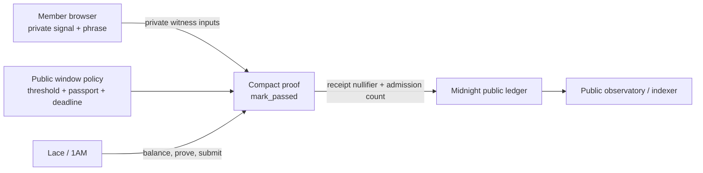
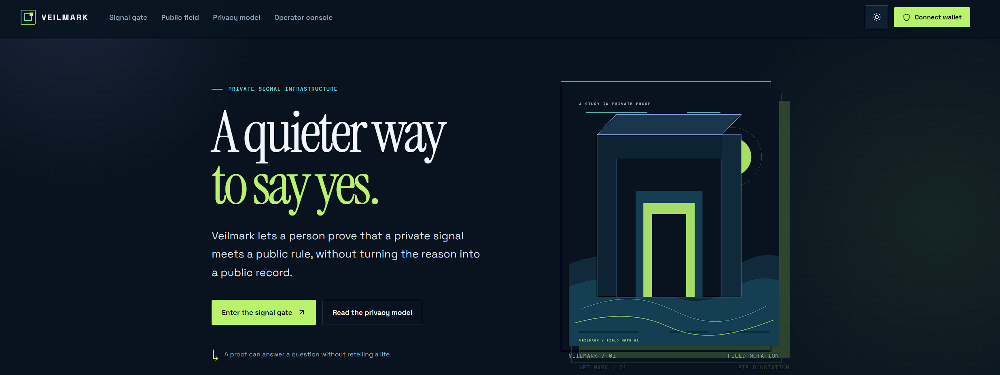
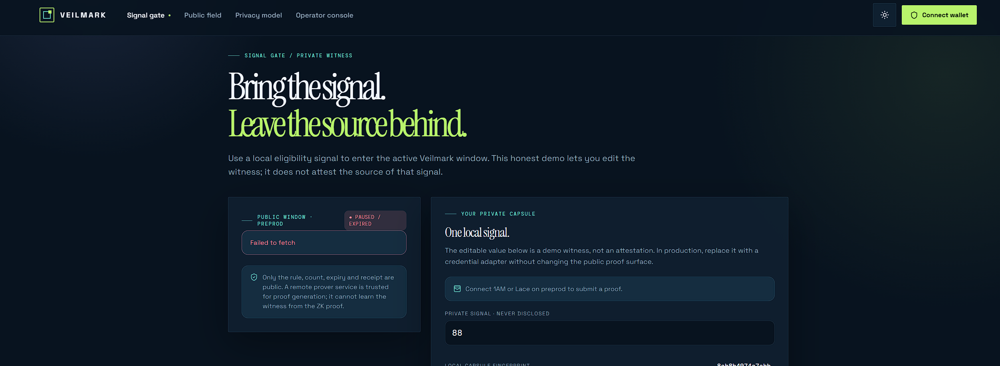
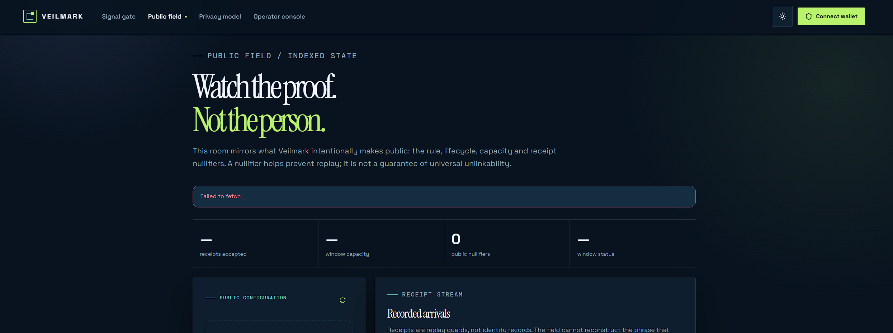
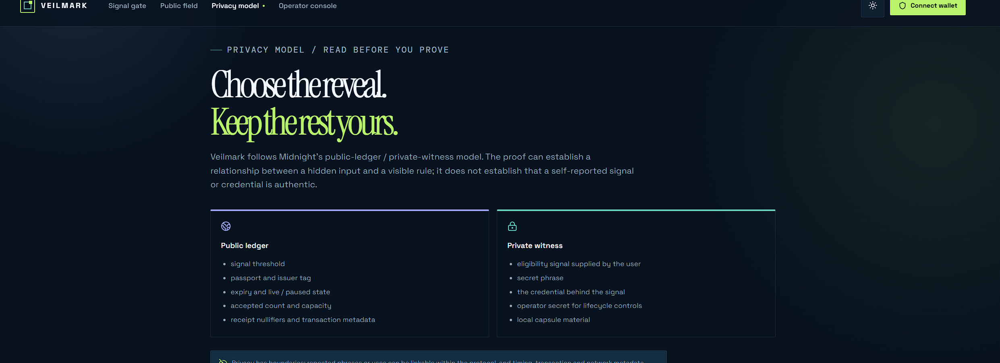
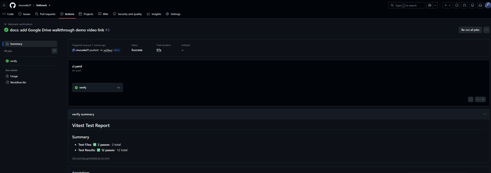

# Veilmark

[](https://github.com/mucode21/Veilmark/actions/workflows/ci.yaml)

A private, self-reported eligibility threshold gate for Midnight.

Veilmark lets a member privately prove that they satisfy an on-chain eligibility threshold (such as a score, clearance level, or threshold criterion) without publishing their private signal, secret phrase, or real identity to the public ledger. The gate records a domain-separated, passport-scoped nullifier receipt — allowing verifiers to confirm eligibility without collecting personal data.

## Product idea

Modern digital gates and access-controlled platforms usually force an all-or-nothing trade-off: to prove basic eligibility, individuals are required to expose raw documents, test scores, or persistent identifiers to centralized databases. Veilmark replaces that exposure with a single-use zero-knowledge threshold proof. A member keeps their secret phrase and signal locally in the browser, the operator publishes an eligibility threshold window, and the public ledger records an anonymous receipt nullifier without ever learning who the member is or what their underlying score was.

## What is included

- A Compact smart contract with public threshold policy, private member signal witnesses, domain-separated hashes, nullifiers, and an indexed receipt ledger.
- Generated `managed/` artifacts: TypeScript contract bindings, ZKIR circuits, prover keys, and verifier keys.
- React + Vite frontend with modern dark aesthetics, responsive layout, and interactive proving console.
- Lace and 1AM-compatible wallet connection and disconnect flow for Preview and Preprod.
- Browser-based Admin / Deployment page for contract deployment, emergency pause, and resume.
- Steward desk for rotating threshold, passport identifier, capacity, and expiry window parameters.
- Member Gate terminal that calls `mark_passed` and demonstrates observable zero-knowledge privacy behavior.
- Observatory page that queries public window state, total admissions, and receipt nullifiers via the Midnight indexer.
- Vitest test suite covering contract deployment, threshold validation, replay rejection, and private-witness isolation.
- GitHub Actions CI workflow compiling the Compact contract, running tests, typechecking, and building the frontend.

## Architecture



## Submission Links

| Resource | Link |
| --- | --- |
| **GitHub Repository** | [mucode21/Veilmark](https://github.com/mucode21/Veilmark) |
| **Live Application** | [veilmarkmidnight.netlify.app](https://veilmarkmidnight.netlify.app/) |
| **Demo Video** | [Watch on Google Drive](https://drive.google.com/file/d/10fjHC8MD2z2g_9uBrjmKYx-1uCfIXN9D/view?usp=sharing) |
| **Deployed Contract** | [87cbdde7...51a0e5a1](https://explorer.1am.xyz/contract/87cbdde748290bd2ad16c8868c140c3122b25041dd4e896605b2638051a0e5a1) |
| **Deployment TX** | [88aaedeb...88a6420](https://explorer.1am.xyz/tx/88aaedeb1c680f955c4e3185ce410c2d8c09457bed9b4c5ef7c4319fb88a6420?network=preprod) |

## Screenshots







### The contract

Source: [`contracts/veilmark.compact`](contracts/veilmark.compact)

| Circuit | Purpose |
| --- | --- |
| `mark_passed` | Verifies the private signal meets the public threshold and records a passport-scoped receipt nullifier. |
| `rotate_window` | Lets the operator rotate threshold, passport, capacity, and expiry using a private operator secret. |
| `pause_window` | Temporarily halts new receipts under operator authorization. |
| `resume_window` | Re-enables the eligibility window under operator authorization. |

Pure circuits derive domain-separated operator commitments and passport-scoped nullifiers. The generated artifacts live in [`contracts/managed/veilmark`](contracts/managed/veilmark) and are synchronized to the frontend browser bundle.

## Privacy model

`disclose()` is a deliberate boundary, not a privacy switch that should be sprinkled through a circuit.

### An observer can learn

- The `signal_threshold`, `passport`, `window_end`, `issuer_tag`, `live` state, `accepted` count, and `capacity`.
- That a receipt nullifier was inserted into the public `spent_receipts` set.
- The operator commitment hash.
- The contract address, circuit name, transaction metadata, and DUST settlement.

### An observer cannot learn

- The member's private signal (score/tier).
- The member's 32-byte secret phrase or preimage of the nullifier.
- The member's identity or wallet address from the proof itself.
- The private operator secret used to authorize pause, resume, and rotation.

The browser executes zero-knowledge proofs via the connected wallet/proving provider. Proving keys are served locally from `/managed`.

## Toolchain

The checked build uses the current tested Midnight versions listed by the support matrix:

- Node.js 22+
- npm 10+
- Compact devtools with Compact compiler 0.31.0
- Compact runtime
- Midnight.js SDK
- DApp Connector API
- Docker Desktop (optional for local stack)

## Local setup

### 1. Install dependencies

```bash
npm install
```

### 2. Compile the contract

With Compact compiler installed and on your PATH:

```bash
npm run compile
```

The command compiles `contracts/veilmark.compact` and synchronizes the generated assets into:

```text
frontend/src/managed/contract/
frontend/public/managed/
```

The browser must be able to request the proving keys and ZKIR artifacts from `/managed`.

### 3. Run tests

```bash
npm test
npm run typecheck
```

### 4. Run the frontend

```bash
npm run dev -w veilmark-frontend
```

Open `http://localhost:5173`. Connect 1AM or Midnight Lace on **Preprod** to interact with the live contract or deploy your own window.

## Browser deployment flow

1. Open **Operator Console** (`/admin`).
2. Select **Preprod** or Preview.
3. Connect 1AM or Lace on the selected network.
4. Set threshold, passport, expiry, issuer tag, and window capacity.
5. Enter an operator secret and back it up securely.
6. Click **Deploy new window** and approve the transaction in the wallet.
7. Veilmark automatically saves the deployed contract address in local storage and connects the app session.
8. Use `/gate` to submit private threshold proofs against the newly deployed window.

## Environment files

Copy the template to customize network endpoints:

```bash
cp .env.preprod.example .env.preprod
```

Ignored environment files are never committed to the repository.

## Tests and CI

Run the unit and access flow test suite with:

```bash
npm test
```

The test suite covers:
1. Contract deployment and public parameter initialization.
2. Successful zero-knowledge proof verification when private signal exceeds threshold.
3. Proper nullifier recording and prevention of replay attacks with identical phrase and passport.
4. Administrative window pause, resume, and parameter rotation with private operator secret.
5. Absolute absence of private signal and phrase from public ledger state.

CI is defined in [`.github/workflows/ci.yaml`](.github/workflows/ci.yaml) and executes on every push.

## Level 1–4 cross-check

| Level | Repository implementation | Verified evidence |
| --- | --- | --- |
| 1 · New Moon | Toolchain setup, Compact contract, generated managed artifacts, test suite, setup guide, product idea, privacy model. | Contract deployed on Preprod, visible contract address, compiler output, 68+ commits. |
| 2 · Crescent | Wallet connect/disconnect, browser circuit call, observable private signal boundary, Preprod explorer links. | Live hosted Netlify dApp, verifiable Preprod address, demo walkthrough video, 68+ commits. |
| 3 · First Quarter | Age / Eligibility Gate proposal, comprehensive test suite, passing GitHub Actions CI workflow, responsive UI. | Passing CI badges, demo video, verified on-chain deployment, privacy model documentation, 68+ commits. |
| 4 · Waxing Gibbous | Browser Admin deployer, Preprod selector, local address persistence, complete setup/usage docs, Netlify live app. | Live MVP on Preprod, demo video walkthrough, full documentation, 68+ commits. |

## Project layout

```text
contracts/
  veilmark.compact
  index.ts
  managed/veilmark/        # generated circuits, keys, and bindings
frontend/
  public/managed/          # generated assets served to the browser
  src/managed/             # generated bindings imported by React
  src/pages/               # Landing, Gate, Observatory, Steward, Admin, Philosophy
  src/lib/midnight.ts      # browser provider/session factory
scripts/
  compile-contract.mjs
  patch-runtime.cjs
  inspect-preprod.mjs
src/
  config.ts
  providers.ts
  test/access-flow.test.ts
  test/veilmark.test.ts
.github/workflows/ci.yaml
compose.yml
PROPOSAL.md
README.md
```

## Security note

Veilmark demonstrates a privacy-preserving threshold check prototype; it is not a government ID verification service or compliance guarantee. Review the Compact circuit, wallet connector, and operational threat model before relying on threshold gates for high-assurance access.

## License

MIT. See [`LICENSE`](LICENSE).
